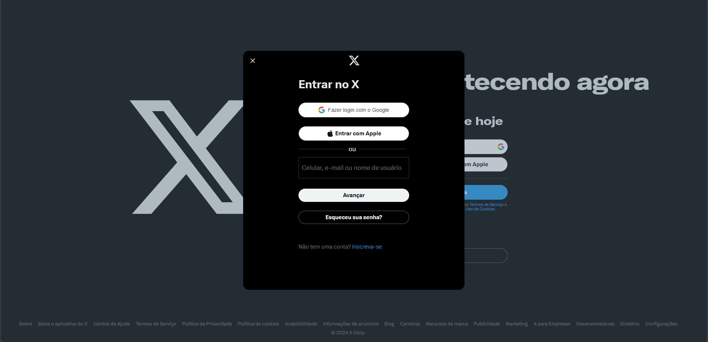
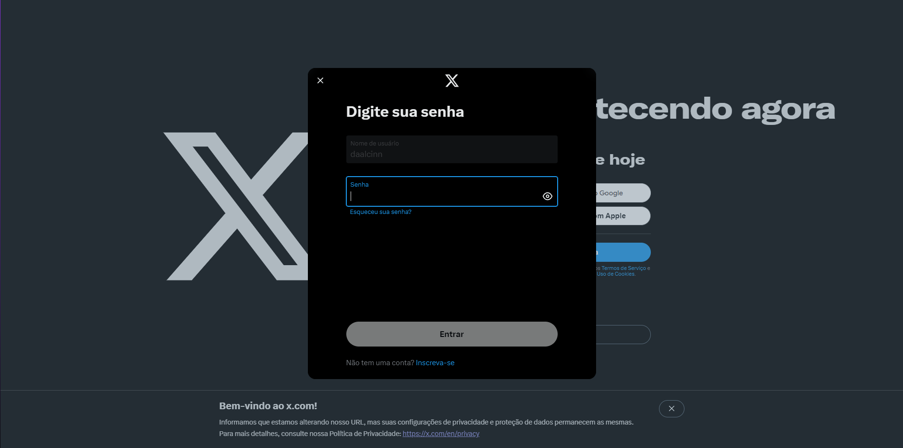

# Twitter Clone - Trabalho Individual 
| Inspiração 1  | Inspiração 2 |
|--|--|
|  |  |

## Investigação: O crime

### Trabalho
- Uma página clonada

### Investigação
-  Trabalho individual;
    
-   Utilizar useState para o login e a senha;
    
-   Um botão que muda uma variável, e quando essa variável muda, utilize o useEffect para verificar se a senha e o login estão corretos;
    
-   Usar styles.module.css;
-   Colocar no git, junto com o seu código, a imagem que foi usada para clone;
